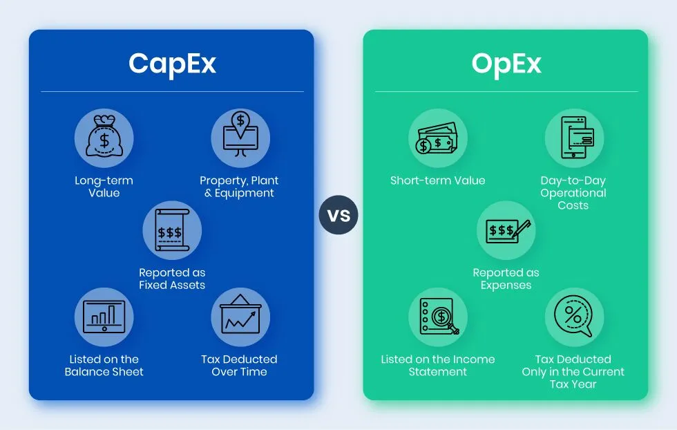
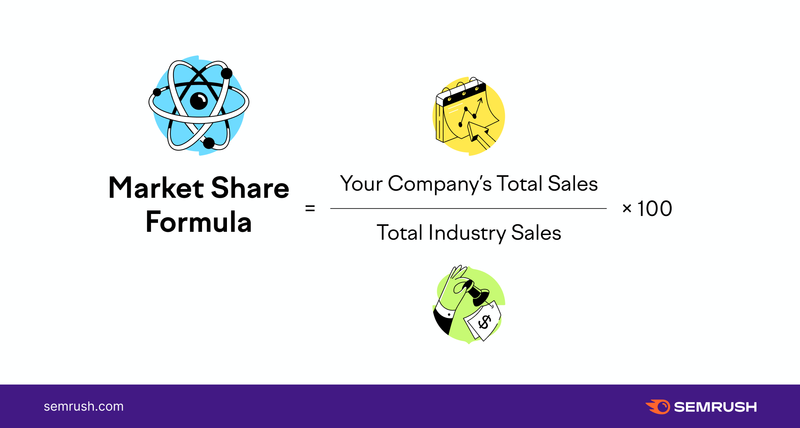

# AWS and Cloud Computing

### What is Cloud Computing?

- Cloud computing is a technology that enables users to access and use **computer resources** like storage, processing power, and applications **over the internet**. It eliminates the need for owning and maintaining physical hardware, offering convenience and scalability. Users can access these services from anywhere with an internet connection, making computing more accessible and efficient.
  

https://www.spiceworks.com/tech/cloud/articles/what-is-cloud-computing/

### Quick history/timeline of Cloud Computing.

- Cloud computing, emerging in the early 2000s, revolutionized IT. Amazon Web Services (AWS) pioneered public cloud services in 2006, followed by Microsoft Azure and Google Cloud. This shift enabled businesses to store data and run applications remotely, boosting scalability and cost-efficiency. Cloud computing continues to evolve, shaping the digital landscape.
- 60's timesharing, 70's application, 80's internet created where companies used timeshare online
  
https://www.bcs.org/articles-opinion-and-research/history-of-the-cloud/
### What can you do with Cloud Computing?

- Cloud computing enables users to access and utilize computer resources (like storage, processing power, and software) over the internet. It offers diverse applications, including data storage, scalable infrastructure, hosting websites and apps, running virtual machines, and facilitating artificial intelligence and data analysis, fostering efficiency, scalability, and cost-effectiveness for businesses and individuals.

### What is “On-Prem”?

- **On Premise** - is the software and hardware that is installed on location of the organisation's physically location.

### What are the 4 TYPES of Cloud?

- There are four primary types of cloud computing: Public Cloud, Private Cloud, Hybrid Cloud, and Multi-Cloud.
  - Public Cloud: Services are provided by third-party vendors and shared among multiple users over the internet.
  - Private Cloud: Infrastructure and services are exclusively dedicated to a single organization, offering greater control and security.
  - Hybrid Cloud: Combines both public and private clouds, allowing data and applications to move seamlessly between them.
  - Multi-Cloud: Involves using multiple public or private clouds simultaneously to meet various business needs, enhancing flexibility and redundancy.

### What are the different types of cloud SERVICE?

- Cloud services encompass Infrastructure as a Service (IaaS), Platform as a Service (PaaS), and Software as a Service (SaaS), catering to varied computing needs.

### Advantages/Disadvantages of the Cloud? Specifically for a business.

- Advantages of the Cloud for businesses include:
  - Cost savings
  - Scalability
  - Flexibility
- Disadvantages include: 
  - Security concerns
  - Reliance on internet connectivity
  - Potential data privacy issues

### What is OpEx vs CapEx?

- **Operating Expenses** - Operating expenses are a company's day-to-day expenses
- **Capital Expenditures** - Capital expenditures are a company's major, long-term expenses

https://dokka.com/capex-vs-opex/
### Market-share - What is the breakdown?

- Market share is calculated by taking the company's sales over the period and dividing it by the total sales of the industry over the same period.

 
https://www.semrush.com/blog/how-to-calculate-market-share/
### What are the 3 largest Cloud providers know for (What makes them popular?)

- Amazon Web Services (AWS)
- Microsoft Azure,
- Google Cloud Platform (GCP)

### What are the 4 pillars of DevOps? 

- Communication
- Collaboration
- Automation
- Monitoring

#### How do they link into the Cloud do you think?
