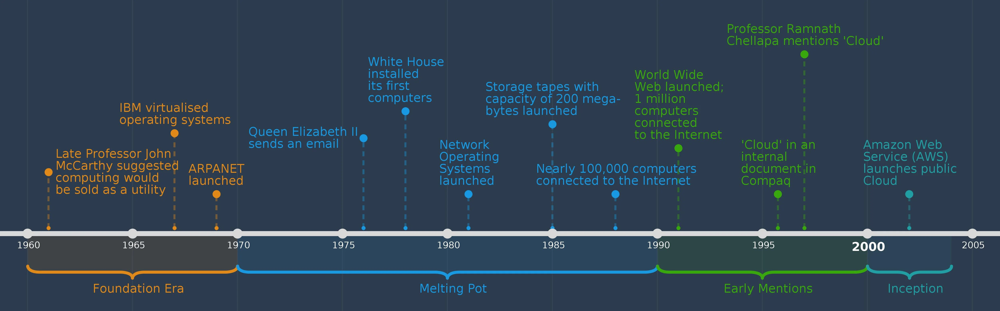
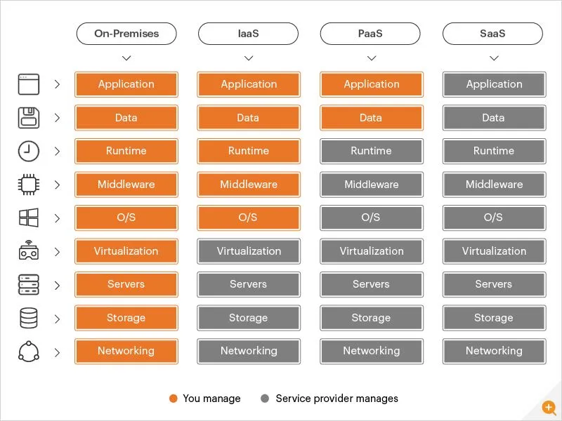
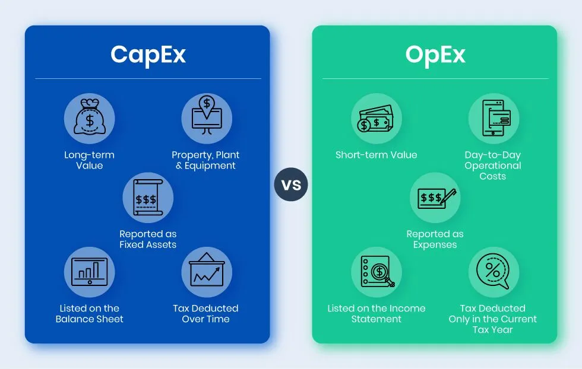
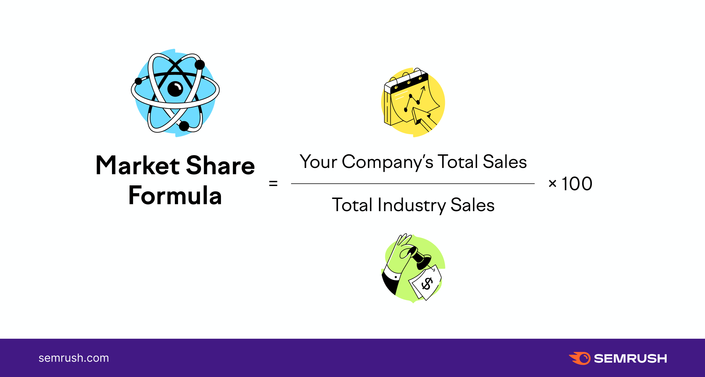

# Cloud Computing

### What is Cloud Computing?

- Cloud computing is a technology that enables users to access and use **computer resources** like storage, processing power, and applications **over the internet**. It eliminates the need for owning and maintaining physical hardware, offering convenience and scalability. Users can access these services from anywhere with an internet connection, making computing more accessible and efficient.
  

https://www.spiceworks.com/tech/cloud/articles/what-is-cloud-computing/

### Quick history/timeline of Cloud Computing.

- Cloud computing, emerging in the early 2000s, revolutionized IT. Amazon Web Services (AWS) pioneered public cloud services in 2006, followed by Microsoft Azure and Google Cloud. This shift enabled businesses to store data and run applications remotely, boosting scalability and cost-efficiency. Cloud computing continues to evolve, shaping the digital landscape.
- 60's timesharing, 70's application, 80's internet created where companies used timeshare online
  
https://www.bcs.org/articles-opinion-and-research/history-of-the-cloud/
### What can you do with Cloud Computing?

- Cloud computing enables users to access and utilize computer resources (like storage, processing power, and software) over the internet. It offers diverse applications, including data storage, scalable infrastructure, hosting websites and apps, running virtual machines, and facilitating artificial intelligence and data analysis, fostering efficiency, scalability, and cost-effectiveness for businesses and individuals.

### What is “On-Prem”?

- **On Premise** - is the software and hardware that is installed on location of the organisation's physically location.

### What are the 4 TYPES of Cloud?

- There are four primary types of cloud computing: Public Cloud, Private Cloud, Hybrid Cloud, and Multi-Cloud.
  - Public Cloud: Services are provided by third-party vendors and shared among multiple users over the internet.
  - Private Cloud: Infrastructure and services are exclusively dedicated to a single organization, offering greater control and security.
  - Hybrid Cloud: Combines both public and private clouds, allowing data and applications to move seamlessly between them.
  - Multi-Cloud: Involves using multiple public or private clouds simultaneously to meet various business needs, enhancing flexibility and redundancy.

### What are the different types of cloud SERVICE?

- Cloud services encompass three main cloud services, catering to varied computing needs.
  - **Infrastructure as a Service** (IaaS) - Provides on-demand infrastructure resources like compute, storage, networking, and virtualization to organizations via the cloud, allowing customers to manage their own infrastructure.
  - **Platform as a Service** (PaaS) - Provides hardware and software resources for application development in the cloud, allowing developers and IT operations teams to manage their infrastructure without building or maintaining it themselves.
  - **Software as a Service** (SaaS) - Offers a cloud-based application stack, managed by the service provider, accessible through a web browser, eliminating the need for device downloads or installations.

  
https://www.eginnovations.com/blog/saas-vs-paas-vs-iaas-examples-differences-how-to-choose/
### Advantages/Disadvantages of the Cloud? Specifically for a business.

- Advantages of the Cloud for businesses include:

  - **Scalability:** Easily expand or shrink resources to meet changing business needs.
  - **Cost Efficiency:** Pay for what you use, reducing capital expenditures.
  - **Flexibility:** Access data and applications from anywhere.
  - **Disaster Recovery:** Robust backup and recovery options.
  - **Collaboration:** Enhance team collaboration through shared access.
  - **Automatic Updates:** Stay current with software and security patches.
  - **Security:** Advanced security measures and compliance options.
  - **Mobility:** Support remote work and mobile devices.
  - **Competitive Edge:** Rapid deployment of new features and services.
  - **Resource Optimization:** Efficiently allocate computing resources.
  - **Eco-Friendly:** Reduce energy consumption and carbon footprint.
  - **Global Reach:** Access a worldwide network of data centers.
  - **Disaster Tolerance:** Geographic redundancy for data safety.
  - **Innovation:** Experiment with emerging technologies and services.

- Disadvantages include:

  - **Security Risks:** Data breaches and cyberattacks threaten sensitive information.
  - **Downtime:** Service outages can disrupt operations and lead to financial losses.
  - **Compliance Challenges:** Meeting regulatory requirements can be complex.
  - **Data Privacy:** Loss of control over data raises privacy issues.
  - **Cost Overruns:** Subscription fees can spiral out of control.
  - **Limited Customization:** Cloud services may not meet unique business needs.
  - **Latency Issues:** Slow internet can impact performance and user experience.
  - **Data Transfer Costs:** Moving large volumes of data can be expensive.
  - **Lack of Control:** Dependence on providers for updates and maintenance.
  - **Hidden Costs:** Additional charges for storage, bandwidth, and support.
  - **Loss of Data:** Potential data loss due to provider issues or errors.
  - **Limited Internet Access:** Unreliable connectivity can disrupt work.
  - **Limited Resources:** Shared resources can lead to performance bottlenecks.
  - **Data Sovereignty:** Compliance with international data laws can be tricky.
  - **Integration Challenges:** Merging cloud and on-premises systems can be complex.

### What is OpEx vs CapEx?

- **Operating Expenses** - Operating expenses are a company's day-to-day expenses. More impactful purchases that are less impactful on the business.

- **Capital Expenditures** - Capital expenditures are a company's major, long-term expenses. Bigger upfront purchases that are less impactful on the business.

https://dokka.com/capex-vs-opex/
### Market-share - What is the breakdown?

- Market share is calculated by taking the company's sales over the period and dividing it by the total sales of the industry over the same period.

 
https://www.semrush.com/blog/how-to-calculate-market-share/
### What are the 3 largest Cloud providers?

- Amazon Web Services (AWS) - 32% MarketShare
- Microsoft Azure - 22% MarketShare
- Google Cloud Platform (GCP) - 11% MarketShare

https://www.statista.com/chart/18819/worldwide-market-share-of-leading-cloud-infrastructure-service-providers/
#### What makes them popular?

- They are popular due to their extensive infrastructure, global reach, and comprehensive service offerings. AWS's early market entry, Azure's seamless integration with Microsoft products, and Google Cloud's data analytics capabilities contribute to their popularity among businesses seeking scalable, reliable cloud solutions.

### What are the 4 pillars of DevOps? 

There is no set 4 Pillars of DevOps, it varies but for Sparta Global, they are:
- **Ease of use** - Is it easy to use?
- **Flexibility** - Industry changes at a fast rate, so do not create systems that rely too heavily on one app, service etc.
- **Robustness** - Uptime, can we get as close to 99.9% uptime as possible?
- **Cost** - How can we be as cost-effective as possible? While being efficient and forward thinking

Other Pillars are:
- Communication
- Collaboration
- Automation
- Monitoring

#### How do they link into the Cloud do you think?
- **Easy to Use:** Cloud platforms offer user-friendly interfaces and automation tools, simplifying deployment and management in DevOps workflows.

- **Flexibility:** Cloud enables scalable resources on-demand, adapting to workload changes, a key DevOps requirement for agility.

- **Robustness:** Cloud providers offer redundant infrastructure, enhancing system reliability and uptime, aligning with DevOps' focus on stability.

- **Cost:** DevOps leverages cloud's pay-as-you-go model, optimizing resource allocation, reducing costs, and maximizing ROI.
