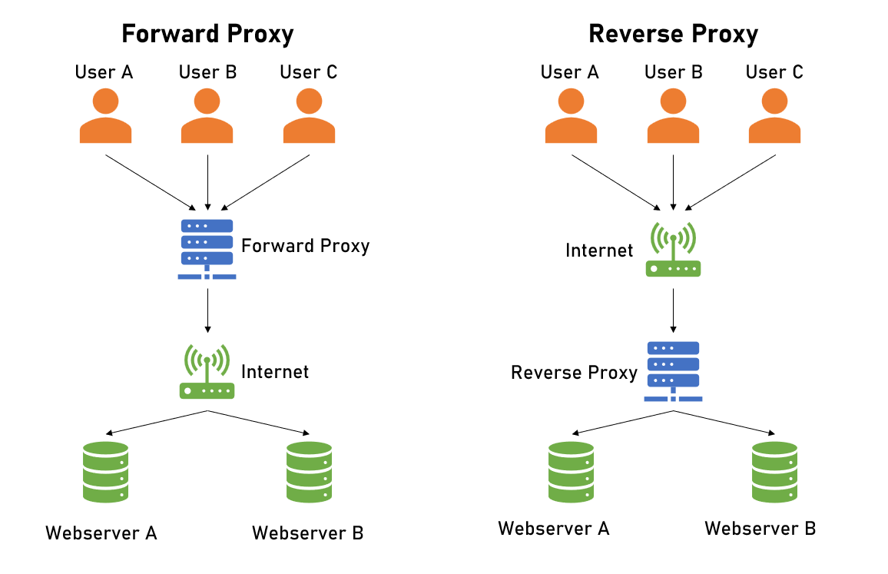

### What are ports?

- A port in networking is a software-defined number associated to a network protocol that receives or transmits communication for a specific service

### What is a reverse proxy? 

- In computer networks, a reverse proxy is an application that sits in front of back-end applications and forwards client requests to those applications. Reverse proxies help increase scalability, performance, resilience and security.

#### How is it different to a proxy? (research)

- A reverse proxy is a server that sits in front of one or more web servers, intercepting requests from clients. This is different from a forward proxy, where the proxy sits in front of the clients.

### Make a diagram for the above point to go with your explanation



### What is Nginx's default configuration (hint - 'sites-available' directory)

- /etc/nginx/nginx.conf

### How do you set up a Nginx reverse proxy?

1. Install Nginx  
- We’ll be using the apt command on Ubuntu 18.04:

```
sudo apt-get update
```
```
sudo apt-get install nginx
```
2. Disable the Default Virtual Host
- Once you have installed Nginx, follow the below command to disable the virtual host:
```
sudo unlink /etc/nginx/sites-enabled/default
```

3. Create the Nginx Reverse Proxy
- After disabling the virtual host, we need to create a file called **reverse-proxy.conf** within the **etc/nginx/sites-available** directory to keep reverse proxy information.

- For this, we should first access the directory using the cd command:

```
cd etc/nginx/sites-available/
```

- Then we can create the file using the vi editor:

```
vi reverse-proxy.conf
```

- In the file, we need to paste in these strings:

```
server {
    listen 80;
    location / {
        proxy_pass http://192.x.x.2;
    }
}
```

- In the above command, the considerable point is the proxy pass is allowing the requests coming through the Nginx reverse proxy to pass along to 192.x.x.2:80, which is Apache remote socket. Thus, both the web servers – Nginx and Apache, shares the content.

- Once completed, simply save the file and exit the vi editor. You can do this by keying in :wq.

- To pass information to other servers, you can use the ngx_http_proxy_module in the terminal.

- Now, activate the directives by linking to /sites-enabled/ using the following command:

```
sudo ln -s /etc/nginx/sites-available/reverse-proxy.conf /etc/nginx/sites-enabled/reverse-proxy.conf
```

4. Test Nginx and the Nginx Reverse Proxy
- Lastly, we need to run an Nginx configuration test and restart Nginx to check its performance. Type the below command to verify the Nginx functioning on the Linux terminal:

```
service nginx configtest
```

```
service nginx restart
```
- Remember, if you receive a failed test, that most likely indicates that Apache was not properly set up.

https://www.hostinger.co.uk/tutorials/how-to-set-up-nginx-reverse-proxy/

###### Bonus: Try and implement a reverse proxy for the app on EC2
