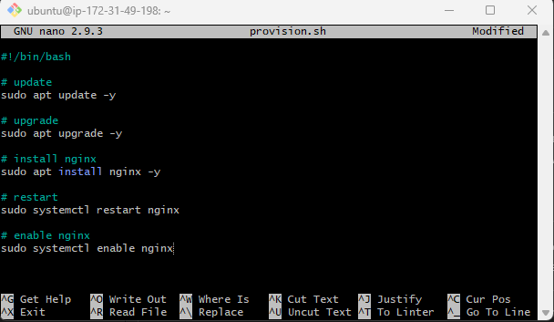
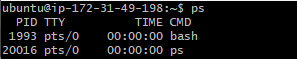
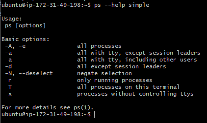
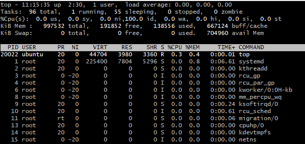

# Starting in the instance in Git Bash
### Scripting
Create a script so that you can multiple commands one by one  
```
nano provision.sh
```
creating file called provision.sh and editing it (.sh is shell file) to exit you do: Crtl+X -> Y -> Enter  
```
#!/bin/bash
```
when editing a script, this needs to be in the top line, this is a shabang, this tells the os that this is a script and not a text file, this allows Linux to run the commands below. **/bin/bash** how are we gonna execute this script, bin bash is the interpreter to run. https://linuxize.com/post/bash-shebang/?utm_content=cmp-true 

Example provision:  


```
./provision.sh
```
This command runs the file in this folder.

### Processes
```
ps
```
This command shows the user processes (processes the user has started in the instance)  

- PID - Process ID
- TTY - Terminal session running with processor
- TIME - Time it has been running for
- CMD - Command  

```
ps --help simple
```
This command shows the basic option commands for ps  


```
ps aux
```
This command shows all information on each process  

```
top
```
This command provides live information on processors being used  

- Shift + M rnak them by memory
- Shift + N ranks by newest
- Shift + P ranks by cpu usage
- Q to exit  

```
sleep 5
```
This command creates a dummy process, taking the amount of time mentioned by number (Simulates a process running. Adding `&` to the end, runs the process in the background, gives an output of process id

```
kill -1 [ID]
```
This command will kill the process marked in the ID, -1 is the least lethal kill command and will output "hangup", there are 64 kill commands, the important ones include.
- `kill -1` - Hangup the process, the least lethal
- `kill -15` - Terminate the process, more deadly than -1
- `kill -9` - Killed the process, most deadly

### Permissions
```
ls -l
``` 
within the long hand ls, there is a set of 10 characters that show the permission of each file and directory
- r - read
- w - write
- x - execute
- they are formatted as`[user][group][other]` with each containing space for rwx

```
chmod [permission] [file]
``` 
change the permissions for a selected file. Example: `u+x` - giving user the ability to execute, you can use numbers to set all the permissions at once, you can calculate the number using the Chmod calculator: https://chmod-calculator.com/, the calculator works be having 3 digits, one for each user type, then add 4 to digit if you want to enable read, 2 for write, and 1 for execute. Example: `sudo chmod 777 bad-joke.txt` this gives all permissions for all users.
- Read = 4
- Write = 2
- Execute = 1

### Enviroment Variable
#### What is a variable?
Label data within a program and store it. So it can be referenced later.


```
printenv [variable]
```
prints the environment variable named or all if left blank, local variable is only available where it is made, environment variable is available everywhere. Example: `MYNAME=Luke` creates a local variable, `export MY_NAME=Luke` creates an environment variable
